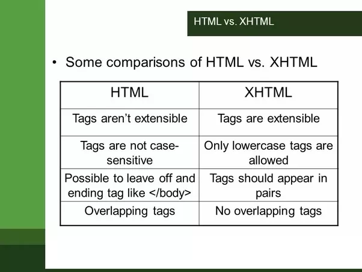

# Teorihandboken - HTML & CSS (HC)
Studerande: Emma Jensen

## HC 1.1 HTML & CSS

#### HTML *(Hypertext markup language)*
HTML är språket som utgör strukturen och formaterar dokument på webbsidor, vilket gör att text konverteras till hypertext och återger sidor i browsern på ett korrekt sätt. HTML tillsammans med HTTP ( Hypertext Transfer Protocol- ett kommunikationsprotokoll ) grunden för World Wide Web.  
Webbsidorna som skrivs i HTML överförs med HTTP över internet. 
I html används taggar för att definiera olika delar av hemsidan, dessa benämns som element och kan vara rubriker, olika typer av stycken (såsom artiklar), listor, tabeller, formulär och många fler typer av strukturelement. 
Genom dessa element kan developers strukturera innehållet av sin kod på ett lättöverskådligt, logiskt och förståeligt sätt. Både för sig själv men även för andra. 
Att använda de globala element som finns i html5 istället för att göra divar som inte nödvändigtvis behövs, gör det dessutom mycket lättare för webbläsaren att förstå vad som finns på sidan, vilket i sin tur leder till att hemsidan blir mer tillgänglig för t.ex. läsverktyg för synskadade eller genom att bara kunna tabba sig genom sidan.


HTML är dock inte ett programmeringsspråk, utan är ett markeringsspråk som genom taggar har i uppgift att ge struktur för hela webbsidans text med styckeindelningar, listor, rubriker, avdelningar osv. 
HTML har inte i uppgift att utföra kommandon, vilket är kriteriet för att ett språk ska kategoriseras som programmeringsspråk.
 Däremot så tillåter HTML infogande av program i t.ex.Javascript för att utföra interaktiva och dynamiska funktioner på webbsidan och använder då css för att styra hur sidan ska se ut i sin design.


#### CSS *(Cascading Style Sheet)*
Css står för Cascading Style Sheet och är en stilmall som styr allt som har med design på en webbsida att göra. 
Det inkluderar bl.a. font, färg och storlek på text,  om hur de olika elementen ser ut och förhå
ller sig till varandra i t.ex. storlek. 
Dessutom styr det även eventuella förändringar i attributen när användaren interagerar med sidan, såsom när dem hovrar med sin muspekare eller webbläsarfönstret ändrar storlek.

Det är viktigt att notera att CSS, även om det kan inbäddas i HTML *(inline styling i varje element eller internal i en style tag)*, är självständigt från HTML och kan användas tillsammans med alla XML-baserade märkningsspråk.

####Inline vs Internal vs External CSS

##### *INLINE*
```
<head>
    <meta charset="UTF-8">
    <meta name="viewport" content="width=device-width, initial-scale=1.0">
    <title>Inline CSS</title>
</head>
<body>
    <!-- Inline styles -->
    <h1 style="color: blue;">This is a Heading</h1>
    <p style="color: green;">This is a paragraph.</p>
</body>
``` 

##### *INTERNAL*
```
<head>
    <meta charset="UTF-8">
    <meta name="viewport" content="width=device-width, initial-scale=1.0">
    <title>Internal CSS</title>
<style>
        h1 {
            color: red;
        }

        p {
            color: purple;
        }
    </style>
</head>

<body>
    <h1>This is a Heading</h1>
    <p>This is a paragraph with internal styles.</p>
</body>
```

##### *EXTERNAL*

```</head>
<body>
    <h1>This is a Heading</h1>
    <p>This is a paragraph with external styles.</p>
</body>
```
```
/* External CSS in a style.css */
body {
    background-color: #f0f0f0;
    font-family: Arial, sans-serif;
}

h1 {
    color: red;
}

p {
    color: purple;
} 
```
---
## HC 1.2 Responsiv design


#### Vad är det och varför är det viktigt?
Responsiv design innebär att utformningen av en webbsida anpassar sig dynamiskt baserat på användarens enhet (dvs skärmstorlek och om skärmen kan rotera), vilket skapar en användarvänlig plattform där allt innehåll fortfarande är lättillgängligt och rent semantiskt bibehåller sin plats även i olika skärmformat.

För att detta ska vara möjligt använder utvecklare media queries i sina stilmallar, och baserar elementens attribut baserat på enhetens upplösning och skärmstorlek. 

Med tanke på hur vi idag har otaliga skärmstorlekar att förhålla oss till så är det av yttersta vikt göra sin design responsiv även mellan pixlarna utvecklarna har satt sina media queries till. T.ex. bör en webbsidas innehåll och elementens förhållande se bra ut även när användaren gör sitt fönster mindre eller större.

För att säkerställa detta är så bör utvecklarna testa sin design på olika enheter under utvecklingens gång.

```
/* Grund för alla*/
body {
    font-family: 'Comic Sans MS', cursive, sans-serif;
}

h1 {
    color: purple;
}

p {
    color: darkorange;
}

/*för skärmar 600 pixlar eller bredare */
@media screen and (min-width: 600px) {
    body {
        background-color: #ffeead;
    }

    h1 {
        color: turquoise;
    }

    p {
        font-size: 18px;
        text-align: center;
    }
}

/* för skärmar 900 pixlar eller bredare */
@media screen and (min-width: 900px) {
    body {
        background-color: #a1dbb2;
    }
}
```

##### HUR? 

För att skapa en responsiv design är det hjälpsamt att använda sig av relativa mätvärden för att skapa en flexibel design. Det kan vara att använda em eller rem för att skala upp eller ner textstorlekar eller sätta containers bredd i procent(%) för att dem ska anpassa sig flexibelt.
  *Något jag själv upplever att jag gärna gör är att tillsätta max-width:100%; på element som absolut inte får sträcka sig utanför dess parent, och ge mig knasiga sidomarginaler på bodyn jag inte bett o, då oftast på bilder.*

Om utvecklaren istället använder t.ex. pixlar för att sätta storlekar på avstånd eller sektioner så blir dessa värden fasta och reagerar därför inte när användaren zoomar in eller gör webbläsarfönstret mindre/större, vilket i sin tur kan skapa problem i relation till resten av webbsidan i andra enheter än den utvecklaren anpassat sina pixlar efter. Det kan bli problematiskt när målet är en dynamisk och flexibel design som ska vara tillgänglig och passa alla.

---

## HC 1.3 Tillgänglighet inom webb
30% av världens befolkning har en funktionsnedsättning hemsidor och 11% har fler funktionsnedsättningar än en.
 Detta utgör en otrolig mängd användare som får svårt att använda en hemsida som inte är tillgänglig för alla. 
 Det i sin tur innebär både att företaget var hemsida inte är tillgänglig förlorar 30% av sina potentiella kunder (därmed pengar) och anses dessutom vara exkluderande genteom funktionsnedsatta, och som grundvärdering ska alla ha samma möjligheter i största möjliga mån. 

 För att göra en webbsida tillgänglig använder sig utvecklare av de WCAG.

 ##### WCAG *(Web Content Accessibility Guidelines)* 
 WCAG 1.0 har funnits sedan maj 1999 och har tre nivåer av guidelines med olika krav för sin tillgänlighet. A, AA och AAA. Nivåerna innebär att hemsidan uppfyller olika många av kriterierna för tillgänglighet. Medan WCAG 1.0 fokuserade främst på HTML så fokuserar WCAG 2.0, som släpptes december 2008, på att alla delar av en hemsida ska vara tillgänglig. WCAG 2.0 blev standard 5e oktober 2012 och ISO-standarden för hemsidor ligger på AA.

>  ###### Några kriterier som är viktiga för att nå WCAG 2.0 AA är:
> - Textkonstrast för att det höjer läsbarheten för användaren.
>-  Att det är intuitivt och lätt att navigera sig på webbsidan. Det kan vara att följa hierarkin i rubriker, att rubrikerna är tydliga, att menyer är placerade intuitivt och lätta att förstå i sitt innehåll. Att använda sig av t.ex. förändring på hover hjälper användaren att se att dem är på rätt ställe och att elementet dem hovrar över är något dem kan interagera med. Var fokuset ligger är också viktigt då användaren eventuellt inte använder mus alls och behöver kunna navigera sig genom endast tangentbordet eller med andra hjälpmedel.
> - Att alla bilder har en alt-text för att användaren ska få en syntolkning om vad bilder inehåller för kontext.

Att följa och få sin tillgänglighet att uppnå WCAG AA är avgörande inom utveckling då produktägare överallt vill ha en tillgänglig webbplats som gynnar alla, oavsett dess förutsättningar och nedsatta förmågor. 

---

## HC 1.4 Aktuella webbstandarder (gällande och kommande standarder)

En Webbstandard utgör riktlinjer och rekommendationer från bl.a W3C gällande hur webbinnehåll ska tolkas och utvecklas för WWW.

Dem bidrar till att säkerställa att det som är publicerat på webben är långsiktigt hållbart. 

SGML *(Standard Generalized Markup Language)*
utvecklades redan på 80-talet och används för att specificera reglerna för hur olika element kan användas för formatering, även om SGML inte används för formateringen i sig. 

Till det använder vi HTML, som baseras på SGML och har den starkaste kopplingen till just Webbsidor. Html skapades i steg 1-4 mellan 1993 och 1998, och efter det lanserades HTML5s första utgåva 2008.
HTML5 blev standard 28e oktober 2014 och den senaste versionen är HTML5.1 som lanserades 2016.

XML- *(extensible markup language)* är inget eget språk utan ett regelverk för hur andra språk kan utformas. Det tillåter mer personliga definitioner av element istället för de fasta elementen i html. Pga detta används XML mestadels från maskin till maskin och sällan i webbläsare.
Övergången från HTML till XML misslyckades dock då XML var mycket mer komplext. Då skapade man XHTML istället.

XHTML-*(extensible hyper text markup language)* används i programvaror som både hanterar HTML och XML. Det blandar stillmallar, HTML4 och riktlinjer för tillgänglighet.
 XHTML ska även göra dokument kompatibla både framåt och bakåt i versioner då det tog vid i sin första version där HTML4.1 slutar och var du XHTML 1.0, nu är den senaste versionen XHTML1.1 Det som utmärker XHTML är att det separerar struktur och presentation vilket gör det flexibelt att ändra i för olika enheter och webbläsare, med andra ord, toppen för tillgänglighet.

 WCAG 2.0 - Web Content Accessability Guidelines
 Dessa riktlinjer beskriver hur utvecklare ska göra webbplatser mer tillgängliga, se HC 1.3

 


######Uniform Resource Identifier (URI, aka URL)

######HyperText Transfer Protocol (HTTP)

Att använda aktuella webbstandarder effektiviserar webbplatsen i många aspekter. 
att använda dem gör att sidorna laddar fortare, stöds av flera plattformar, är lättare för utomstående utvecklare att sätta sig in i, gör att webbsidan håller sig aktuell under längre tid då troligheten att den fungerar även under nästa standard är större än om du kör den tidigare versionen. 
Det ökar även tillgängligheten för t.ex. skärmläsarprogram.


## HC 1.5 CSS Pre-processorer (ex SASS/LESS)
Sass *(Syntactically Awsome Stylesheets)* är en extension av vanlig css, men är inte bekgränsad till pure utan används även tillsammans med ramverk, och ger utvecklare möjlighet att ändra kod effektivt och slippa återanvända samma attribut och skriva ut kod i varje element för styling.

 Detta effektiviserar även att t.ex. Om allt som är rött på en sida är stylat med varibeln (exempel) $my-favorite-color: red;. Detta kan vara som border på artiklar och bakgrundsfärg på knappar, on hover för a etc etc, och ganska tradigt, men framförallt tidskrävande, att skriva om på alla ställen, och då kan jag istället ändra $my-favorite-color:red; till $my-favorite-color:green;
Och då blir alla element med färgen röd istället grön i bara en ändring. 
Detta används för att också uppehålla en av de viktigaste motton en utvecklare bör följa: "Don't repeat yourself".

Sass tillåter även att nästla CSS intuti varandra, det gr koden mer kompakt, mer lättläst och lättare att navigera sig i. Detta är i sig hjälpsamt när andra ska läsa ens kod. 

Att Sass utöver att göra koden effektiv att använda och läsa så går den även att dela upp i mindre filer (partials) som även det kan göra strukturen mer överskådlig.

SASS är däremot inte läsbart av HTML men går att kompilera till CSS.

SCSS (Sassy CSS) har några syntaxskillnader från SASS. 
SCSS använder bla {} och ;
medan SASS använder varken.

###### *SASS*

```body
  font: 
    family: Arial, sans-serif
  color: #333
  ```

###### *SCSS*
``` body {
  font: {
    family: Arial, sans-serif;
  }
  color: #333;
} 
```
De som gärna använder SCSS menar ofta på att det är mer lättläst då det liknar Css mer i sin syntax och de som använder SASS betonar den indenterade syntaxen är mer läslig och minskar onödig kod.
SCSS används dock mer i moderna projekt.

Från det jag läser så verkar valet mellan SASS och SCSS handla om egen preferens gällande syntax och projektets karaktär.


## HC 1.6 Optimering och validering av HTML & CSS
Beskriv rubriken nedan här


Länkar:
>[- Best practise for Css Units](https://wpengine.com/resources/choose-css-unit-create-better-site-layouts-how-to/#Types_of_CSS_Units)
 > [- Webbdesign ur ett tillgänglihetsperspektiv-examensarbete](https://www.diva-portal.org/smash/get/diva2:1028248/FULLTEXT01.pdf)
 > [- Statistik om funktionsnedsättning](https://www.funka.com/funka--tillg%C3%A4nglighet/statistik/)
 > [- WCAG overview](https://www.w3.org/WAI/standards-guidelines/wcag/)
 > [- Webbstandard](https://webperf.se/tag/webbstandard/)
 > [- Webbstandard XHTML](https://www.bestonline.se/datakurser/webbutveckling1/teori/internet%20webbstandard.php)
 > [- Webbstandard 2](https://webflow.com/blog/web-standards)
 > [- Sass](https://cleancommit.io/blog/what-are-the-benefits-of-sass-in-2022/)